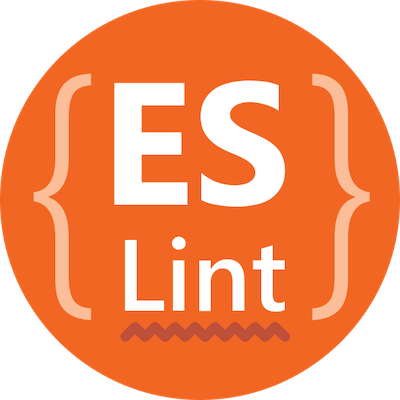

<h1 align="center">
    
</h1>

<h2>
    🚀 Projeto
</h2>

Mantenha o foco e aumente sua produtividade com o Move.it, um projeto que consiste na tecnica "Pomodoro".

No fim de cada sessão (25 minutos de foco) você irá descansar por 5 minutos e fazer um desafio que aparecerá na tela, isso vai fazer com que você consiga ficar mais tempo na frente do computador sem cansar e o cerébro filtrar mais o conhecimento que está aprendendo, cada desafio concluído te dará XP para upar para o próximo nivel.

<h2>
    📕 Sobre o Evento
</h2>

Move.it foi desenvolvido durante os dias 22 a 28 de Fevereiro, foi a 4° edição do NLW (Next Level Week) pela equipe da Rocketseet, ministrado pelo professor Diego Fernandes, CTO da Rocketseet.

<h2>
    🔨 Tecnologias
</h2>

 * 

    
    
    

 * 

    
    

* 

    

    
    

