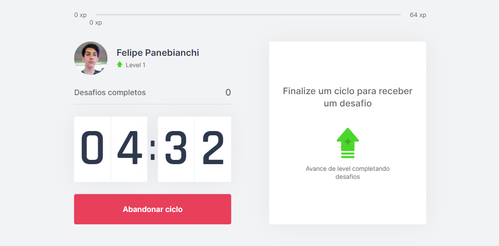
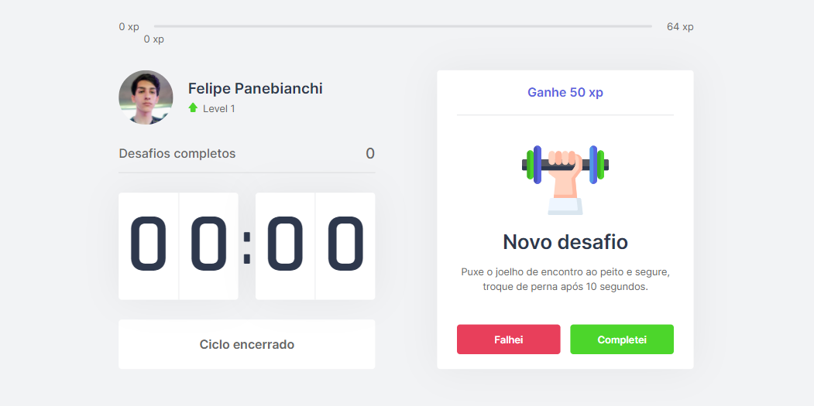
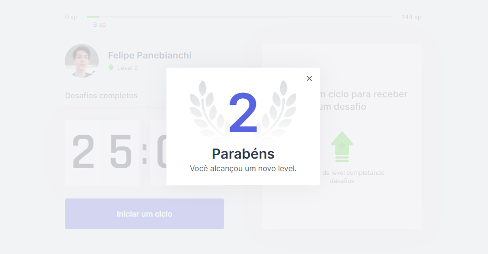
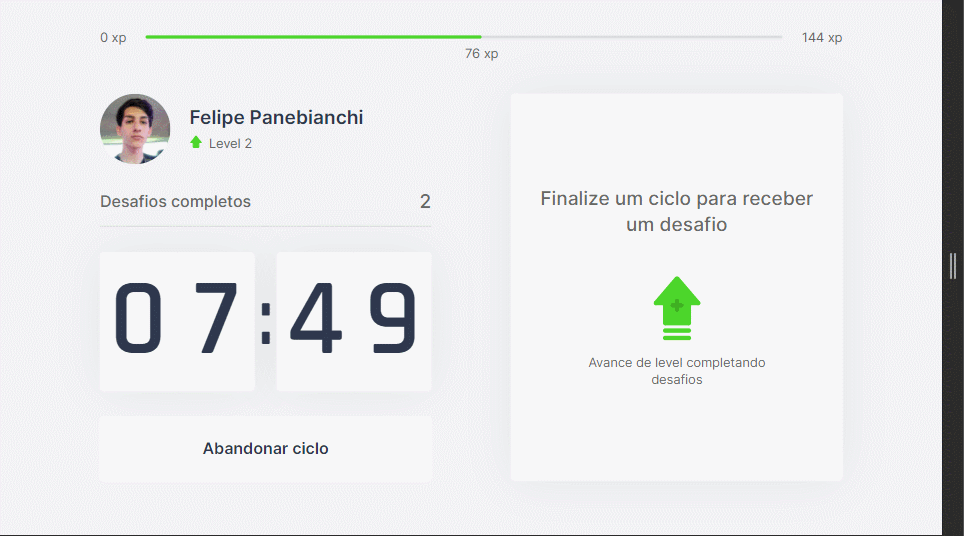

<h1 align="center">
    
</h1>

<h2>
    🚀 Projeto
</h2>
<p>Mantenha o foco e aumente sua produtividade com o Move.it, um projeto que consiste na tecnica "Pomodoro".</p>

<p>No fim de cada sessão (25 minutos de foco) você irá descansar por 5 minutos e fazer um desafio que aparecerá na tela, isso vai fazer com que você consiga ficar mais tempo na frente do computador sem cansar e o cerébro filtrar mais o conhecimento que está aprendendo, cada desafio concluído te dará XP para upar para o próximo nivel.</p>
<hr>

<h2>
    📕 Sobre o Evento
</h2>
<p>Move.it foi desenvolvido durante os dias 22 a 28 de Fevereiro, foi a 4° edição do NLW (Next Level Week) pela equipe da Rocketseet, ministrado pelo professor Diego Fernandes, CTO da Rocketseet.</p>
<hr>

<h2>
    🔨 Tecnologias
</h2>

<ul>
    <li>HTML</li>
    <li>CSS</li>
    <li>Typescript</li>
    <li>Node JS</li>
    <li>Git</li>
    <li>Prettier</li>
    <li>ESLint</li>
</ul>

<hr>

<h2>
    Confira o Projeto! 
</h2>




<hr>

<h2>Também para Android e IOS</h2>


<hr>

<h2>
    Como contribuir
</h2>

```bash
    # Entre no seu terminal para clonar o projeto

    $ git clone https://github.com/FWeb-Developer/Moveit-Pomodoro.git

```

```bash
    # Entre na pasta

    $ cd Moveit-Pomodoro
```

```bash
    # Instale as dependências

    $ yarn install
```

```bash
    # Rode a aplicação

    $ yarn dev
```

<hr>
<h2>📝 Licença</h2>

<p>Este projeto esta sob uma <a href="https://pt.wikipedia.org/wiki/Licen%C3%A7a_MIT#:~:text=A%20licen%C3%A7a%20MIT%2C%20tamb%C3%A9m%20chamada,livre%20quanto%20em%20software%20propriet%C3%A1rio."></a></p>