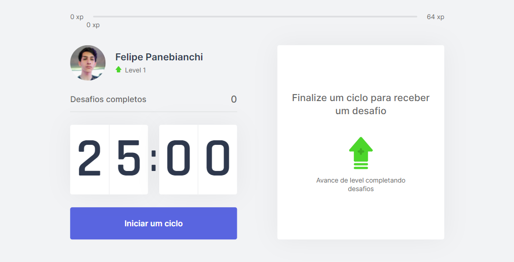

<h1 style="text-align: center"></h1>

<h2 style="text-align: center; margin-bottom: 20px">Descrição do Projeto :</h2>

 A Técnica de "Pomodoro" é um método de gerenciamento de tempo, que consiste em auxiliar seus estudos com intervalos de 5 minutos para aumentar sua produtividade, este projeto foi desenvolvido durante a Next Level Week pela equipe da rocketseet, ministrado pelo Professor Diego Fernandes

<h2 style="text-align: center; margin-bottom: 10px">Framework :</h2>

    
    
Next.js é uma estrutura da web de desenvolvimento front-end React de código aberto que permite funcionalidades como renderização do lado do servidor e geração de sites estáticos para aplicativos da web baseados em React.

<h2 style="text-align: center; margin-bottom: 30px">Tecnologias :</h2>

    

        
        
        
    

    

        
        
        
    

    

    <h2 style="text-align: center; margin-bottom: 30px">Confira o projeto !</h2>
    

        
        
        
        
    

    

        

            
            
        
 
        

            
            
        

       

    

    
        

